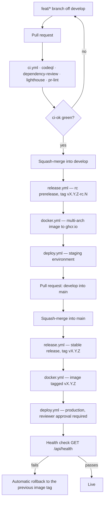

# vladimirshikov-site

[](https://github.com/iuriishikov/vladimirshikov-site/actions/workflows/ci.yml)
[](https://github.com/iuriishikov/vladimirshikov-site/actions/workflows/codeql.yml)
[](https://github.com/iuriishikov/vladimirshikov-site/releases)
[](./LICENSE)

The personal website of Vladimir Shikov — **vladimirshikov.com**.

The infrastructure is finished and production-grade: architectural boundaries, type safety, i18n,
testing at four levels, a hardened supply chain, a container build, CI gates and an SSH-based
deployment to a VPS.

On top of it sits the **portfolio page** — a full implementation of the Portfolio design canvas:
a bilingual single-page site with a fixed glass header, a generated pencil portrait, selected works,
services, a partner marquee, a review carousel, an FAQ accordion and a dark footer, in a light and a
dark theme.

The copy is still placeholder. Every string already goes through the dictionaries in `messages/`,
so replacing lorem ipsum with the real thing is an edit to two JSON files, not to the components.
Case and note pages are stubs pending their own design.

The reason for building it in this order: content is cheap to add and expensive to add _safely_.
Every guard rail exists before the first paragraph of prose is written.

---

## Stack

Versions below are the ones declared in [`package.json`](./package.json). Exact resolutions are
pinned in `pnpm-lock.yaml`.

| Area               | Choice                                                                  | Version                 |
| ------------------ | ----------------------------------------------------------------------- | ----------------------- |
| Framework          | Next.js — App Router, Turbopack dev, `output: 'standalone'`             | 16.3.2                  |
| UI runtime         | React / react-dom, React Compiler enabled                               | 19.2.8                  |
| Language           | TypeScript, `strict` plus the optional strictness flags                 | 6.0.3                   |
| Runtime            | Node.js (`.nvmrc`, `.node-version`)                                     | 24                      |
| Package manager    | pnpm via corepack, isolated node linker                                 | 11.22.0                 |
| Styling            | Tailwind CSS — CSS-first `@theme`, no `tailwind.config.js`              | 4.3.3                   |
| i18n               | next-intl — `ru` (default) and `en`, `localePrefix: 'always'`           | 4.13.7                  |
| Server state       | TanStack Query                                                          | 5.102.2                 |
| Client state       | Zustand                                                                 | 5.0.15                  |
| Schemas            | Zod                                                                     | 4.4.3                   |
| Forms              | react-hook-form + `@hookform/resolvers`                                 | 7.86.0 / 5.9.1          |
| UI primitives      | radix-ui · sonner · next-themes                                         | 1.6.7 · 2.0.8 · 0.4.6   |
| Lint               | ESLint flat config + typescript-eslint + eslint-plugin-boundaries       | 10.9.0 / 8.67.0 / 7.2.0 |
| Format             | Prettier + import sorting + Tailwind class sorting                      | 3.9.6                   |
| Unit tests         | Vitest + Testing Library                                                | 4.1.11 / 16.3.2         |
| E2E                | Playwright + `@axe-core/playwright`                                     | 1.62.1 / 4.13.0         |
| Component workshop | Storybook + a11y addon                                                  | 10.5.10                 |
| Perf budgets       | Lighthouse CI — run by the CI action, configured in `lighthouserc.json` | v12 (action)            |
| Releases           | semantic-release + Conventional Commits                                 | 25.0.9                  |
| Local gates        | husky · lint-staged · commitlint + cz-git                               | 9.1.7 · 17.3.0 · 21.2.2 |
| Hygiene            | knip (dead code) · secretlint (secrets)                                 | 6.32.2 · 13.0.4         |

Why these, and not the obvious alternatives: see the [decision records](./docs/adr/).

---

## Quick start

```bash
# Node 24 and pnpm 11 — corepack reads the packageManager field from package.json
nvm use              # or: fnm use — both read .nvmrc
corepack enable

git clone git@github.com:iuriishikov/vladimirshikov-site.git
cd vladimirshikov-site

make bootstrap        # or by hand: pnpm install && cp .env.example .env.local
pnpm dev
```

`make bootstrap` checks Node against `.nvmrc`, activates the pinned pnpm, installs from the frozen
lockfile, creates `.env.local`, and installs the Playwright browser. Run `make help` for the rest —
the Makefile is a thin, discoverable wrapper over the pnpm scripts and the deploy script.

Open `http://localhost:3000` — `/` redirects to `/ru`.

Two things that surprise people on a first install:

- **`pnpm install` can refuse a brand-new package version.** `minimumReleaseAge: 1440` in
  `pnpm-workspace.yaml` quarantines any version published less than 24 hours ago. That is
  deliberate — see [docs/security.md](./docs/security.md).
- **`.env.local` is not optional.** `src/shared/config/env.ts` validates the environment with Zod, so
  a malformed `SITE_URL` fails fast instead of surfacing as `undefined` at 3am. Note that `SITE_URL`
  and `APP_ENV` deliberately have no `NEXT_PUBLIC_` prefix: they are read at request time, so one
  container image serves both staging and production.

---

## Scripts

| Script                 | What it does                                                               |
| ---------------------- | -------------------------------------------------------------------------- |
| `pnpm dev`             | Next.js dev server on Turbopack, port 3000                                 |
| `pnpm build`           | Production build into `.next` (standalone output)                          |
| `pnpm start`           | Serves the production build                                                |
| `pnpm analyze`         | Build with `@next/bundle-analyzer`, writes a bundle report                 |
| `pnpm typecheck`       | `tsc --noEmit` over the whole project                                      |
| `pnpm lint`            | ESLint, `--max-warnings=0`                                                 |
| `pnpm lint:fix`        | ESLint with `--fix`                                                        |
| `pnpm format`          | Prettier, write mode                                                       |
| `pnpm format:check`    | Prettier, check mode — what CI runs                                        |
| `pnpm test`            | Vitest, single run                                                         |
| `pnpm test:watch`      | Vitest, watch mode                                                         |
| `pnpm test:coverage`   | Vitest with v8 coverage and the coverage thresholds                        |
| `pnpm e2e`             | Playwright — chromium, plus firefox/webkit/mobile-safari once installed    |
| `pnpm e2e:install:all` | Installs all four browsers for a full cross-browser run                    |
| `pnpm e2e:ui`          | Playwright's interactive UI mode                                           |
| `pnpm e2e:install`     | Installs the Chromium browser plus its OS dependencies                     |
| `pnpm storybook`       | Storybook dev server on port 6006                                          |
| `pnpm build-storybook` | Static Storybook build into `storybook-static`                             |
| `pnpm knip`            | Reports unused files, exports and dependencies                             |
| `pnpm validate`        | `format:check` → `lint` → `typecheck` → `test`. **Run before every push.** |
| `pnpm commit`          | Guided Conventional Commit prompt (cz-git)                                 |
| `pnpm release`         | semantic-release — CI only, never run by hand                              |
| `pnpm docker:build`    | Builds the production image as `vladimirshikov-site:local`                 |
| `pnpm docker:run`      | Runs that image on port 3000 with `.env.local`                             |
| `pnpm clean`           | Removes build, coverage, report and cache directories                      |
| `pnpm prepare`         | Installs the husky hooks (runs automatically after install)                |

---

## Layout

```text
.
├── src/
│   ├── app/                  Next.js App Router — routing and composition only
│   │   ├── [locale]/         localised routes: /ru, /en, /ru/about, /en/about
│   │   ├── api/health/       liveness endpoint the deploy job polls
│   │   ├── _providers/       client providers mounted once, at the root
│   │   └── _styles/          globals.css — the Tailwind v4 @theme lives here
│   ├── views/                FSD "pages" layer: one screen each (Next owns `app`)
│   ├── widgets/              self-contained composite blocks (header, footer)
│   ├── features/             one user action each (theme toggle, locale switch)
│   ├── entities/             business nouns and how they render
│   ├── shared/               framework-agnostic reuse
│   │   ├── config/env.ts     the only module that reads process.env
│   │   ├── i18n/request.ts   next-intl request configuration
│   │   ├── test/setup.ts     Vitest global setup
│   │   ├── ui/               design-system primitives
│   │   └── lib/              pure helpers, including cn()
│   ├── proxy.ts              next-intl routing plus the per-request CSP nonce
│   └── instrumentation.ts    server startup hook
├── e2e/                      Playwright specs, including the axe accessibility sweep
├── messages/                 next-intl message catalogues, one per locale
├── scripts/                  bootstrap.sh, deploy.sh, setup-branch-protection.sh
├── docs/                     architecture, conventions, CI/CD, deployment, ADRs
├── .github/
│   ├── workflows/            CI, CodeQL, Scorecard, release, docker, deploy, rollback
│   ├── rulesets/             branch protection for main and develop, as JSON
│   └── renovate.json5        dependency automation (Dependabot covers Actions)
├── .storybook/               Storybook main.ts and preview.tsx
├── .vscode/                  shared editor settings, extensions and debug configs
├── public/                   static assets served verbatim — created with the first one added
├── Dockerfile                multi-stage build of the standalone image
├── docker-compose*.yml       the VPS stack: web + caddy (plus staging and local overrides)
├── Caddyfile                 TLS, edge headers and proxy rules
├── Makefile                  discoverable wrapper over the scripts — run `make help`
└── <root configs>            eslint · prettier · vitest · playwright · knip · lighthouse
```

The import direction is enforced, not merely documented: `app → views → widgets → features →
entities → shared`, one way only. See [docs/architecture.md](./docs/architecture.md).

---

## How a change reaches production



Details: [docs/ci-cd.md](./docs/ci-cd.md) and [docs/deployment.md](./docs/deployment.md).

---

## Documentation

| Document                                       | Read it when                                       |
| ---------------------------------------------- | -------------------------------------------------- |
| [docs/onboarding.md](./docs/onboarding.md)     | It is your first day — start here                  |
| [docs/architecture.md](./docs/architecture.md) | You are about to add a file to `src/`              |
| [docs/conventions.md](./docs/conventions.md)   | You are about to write a commit or open a PR       |
| [docs/branching.md](./docs/branching.md)       | You need to know where a branch belongs            |
| [docs/testing.md](./docs/testing.md)           | You are deciding what kind of test to write        |
| [docs/ci-cd.md](./docs/ci-cd.md)               | A check is red and you want to know what it guards |
| [docs/deployment.md](./docs/deployment.md)     | Something is wrong on the server                   |
| [docs/security.md](./docs/security.md)         | You are adding a dependency or touching headers    |
| [docs/adr/](./docs/adr/)                       | You want to know _why_ something is the way it is  |
| [CONTRIBUTING.md](./CONTRIBUTING.md)           | You are contributing a change                      |
| [SECURITY.md](./SECURITY.md)                   | You found a vulnerability                          |

---

## Licence

[MIT](./LICENSE) © 2026 Vladimir Shikov.
