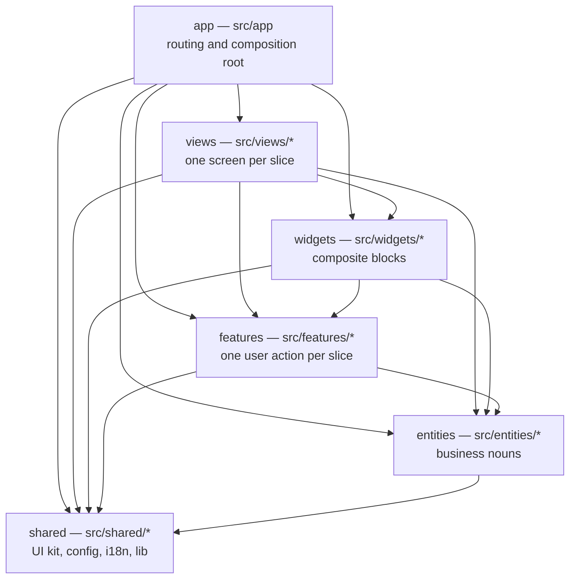

# Architecture — Feature-Sliced Design

This repository uses [Feature-Sliced Design](https://feature-sliced.design/) (FSD). The value of FSD
here is not the vocabulary; it is that a single rule — _imports only ever point downwards_ — is
checked by ESLint on every commit, so architectural drift fails CI instead of accumulating.

The decision itself is recorded in [ADR 0002](./adr/0002-feature-sliced-design.md).

---

## Layers

Most abstract first. A module may import from layers **strictly below** its own, and from nothing
else.

| Layer      | Directory              | Holds                                                                     | May import                                     |
| ---------- | ---------------------- | ------------------------------------------------------------------------- | ---------------------------------------------- |
| `app`      | `src/app`              | Next.js routes, layouts, providers, metadata — composition only           | views, widgets, features, entities, shared     |
| `views`    | `src/views/<slice>`    | One screen's layout and data orchestration                                | own slice, widgets, features, entities, shared |
| `widgets`  | `src/widgets/<slice>`  | Self-contained composite blocks: site header, footer, hero                | own slice, features, entities, shared          |
| `features` | `src/features/<slice>` | One user action: switch locale, toggle theme, submit the contact form     | own slice, entities, shared                    |
| `entities` | `src/entities/<slice>` | A business noun and how it renders: author, article                       | own slice, shared                              |
| `shared`   | `src/shared/<segment>` | Anything reusable and domain-free: UI primitives, config, i18n, lib, test | shared                                         |



Every arrow that is _not_ drawn above is an ESLint error. There is no arrow back into `app`: it is
the composition root, and nothing may import from it.

`src/proxy.ts` and `src/instrumentation.ts` sit beside the layers rather than inside one. They are
Next.js framework entrypoints, matched by none of the `boundaries/elements` patterns, so they are
outside the architecture graph — deliberately, because there is nothing above them to constrain.
Treat them as composition, like `app`: they may reach downwards, and nothing imports them.

---

## Why the FSD "pages" layer is called `views`

Canonical FSD names this layer `pages`. Next.js App Router owns `src/app`, and `src/pages` is a
reserved directory that would activate the legacy Pages Router — Next.js would try to route from it.

Renaming FSD's `pages` to `views` avoids that collision without weakening the model. `src/app`
therefore contains only Next.js-shaped files (`page.tsx`, `layout.tsx`, `route.ts`, `sitemap.ts`,
…), each of which is a thin wrapper that renders a slice from `src/views`:

```tsx
// src/app/[locale]/about/page.tsx — thin, framework-shaped, no logic
import { AboutView } from '@/views/about'

export default function AboutPage() {
  return <AboutView />
}
```

The screen itself lives in `src/views/about`, where it is testable without Next.js routing.

---

## How the rule is enforced

Two ESLint rules in [`eslint.config.mjs`](../eslint.config.mjs) carry the whole architecture.
Nothing here relies on a reviewer noticing.

### 1. `boundaries/dependencies` — layer order and public APIs

Every layer directory is registered as an element type, and one rule decides which element may
import which. It runs with `default: 'disallow'`, so an unlisted combination is an error rather than
a gap, and the **last matching policy wins** — the policies are ordered so later ones narrow earlier
ones.

The layer order exists in exactly one place; the policies are generated from it:

```js
const LAYERS = ['app', 'views', 'widgets', 'features', 'entities', 'shared']
const layersBelow = (layer) => LAYERS.slice(LAYERS.indexOf(layer) + 1)
```

The three policy groups, in the order they are applied:

1. **Layer order.** Each layer may reach the layers below it. `app` may additionally import `app`,
   because a route file legitimately imports the providers sitting next to it, and `shared` may
   import `shared`, because its segments are one library rather than a set of slices.
2. **Public API.** An import into a `views`, `widgets`, `features` or `entities` element is
   disallowed when the path it lands on inside that slice is anything other than `index.ts`. This
   fires even where step 1 allowed the layer pair, which is the point of the ordering. `shared` is
   left out of this group on purpose: its segments are plain libraries, and deep imports
   (`@/shared/ui/button`) keep the bundle from pulling in the whole kit through one barrel file.
3. **Own slice.** A module may freely use the other segments of _its own_ slice — matched by
   comparing the captured slice name on both sides — which re-permits what step 2 just forbade, but
   only within one slice. That is how a slice's `ui` segment reaches its `model` segment.
   Cross-slice traffic inside a single layer stays forbidden; it is what keeps two features from
   growing into each other.

The two messages you will actually see, with the templates filled in:

```text
"features" may not depend on "widgets" — a layer only imports layers below it, and never
sideways into another slice (see docs/architecture.md)

Import the public API of "features/contact-form" (its index.ts) — reaching into internals
couples you to details that slice may change
```

```ts
import { ContactForm } from '@/features/contact-form' // ✅ public API
import { ContactForm } from '@/features/contact-form/ui/contact-form' // ❌ the second message
```

### 2. `no-restricted-imports` — the app layer

One pattern group, `@/app` and `@/app/*`: nothing may import from the composition root. `app` is not
a library, and an import out of it would make a lower layer depend on routing.

There is deliberately **no** ban on relative `../../` paths. Inside `shared`, reaching a sibling
segment (`../../lib/cn`) is correct rather than a violation, and `boundaries/dependencies` resolves
imports to files — so it catches a cross-slice reach whether it is spelled as an alias or as a
relative path. A blunt pattern ban would only duplicate that badly.

Run the whole set with `pnpm lint`. The pre-commit hook runs it on staged files; CI runs it over the
project with `--max-warnings=0`.

---

## Slice anatomy: segments

Inside a slice, files are grouped by _technical purpose_, not by type. Only create the segments a
slice actually needs.

| Segment  | Contains                                                      |
| -------- | ------------------------------------------------------------- |
| `ui`     | React components and their styles                             |
| `model`  | State, stores, hooks, business logic, Zod schemas             |
| `api`    | Requests, server actions, TanStack Query options, DTO mapping |
| `lib`    | Slice-local helpers, pure and testable                        |
| `config` | Slice-local constants, feature flags, route names             |

A slice that happens to need every segment — no slice in this scaffold does yet — would look like
this:

```text
src/features/edit-profile/
├── ui/
│   ├── edit-profile-form.tsx
│   ├── edit-profile-form.test.tsx     ← colocated unit test
│   └── edit-profile-form.stories.tsx  ← colocated story
├── model/
│   ├── profile-schema.ts              ← Zod schema, shared by form and server action
│   └── use-edit-profile.ts
├── api/
│   └── save-profile.ts
└── index.ts                           ← the public API — the only file others may import
```

The `shared` layer uses the same segment names one level higher (`src/shared/ui`,
`src/shared/config`, `src/shared/i18n`, `src/shared/lib`, `src/shared/test`), because `shared` has
no slices.

---

## The public API rule

Every slice exposes an `index.ts` that re-exports exactly what the outside world may use.

```ts
// src/features/contact-form/index.ts — the real one in this repository
export { subscribe, type SubscribeResult } from './api/subscribe'
export { ContactForm } from './ui/contact-form'
```

Three consequences that make this worth the extra file:

1. **Refactoring is free inside the slice.** Move `ui/contact-form.tsx` anywhere as long as
   `index.ts` still resolves; no other file changes.
2. **The blast radius of a change is visible.** Whatever is not in `index.ts` has exactly one
   consumer: the slice itself.
3. **Dead code is detectable.** `pnpm knip` reports exports in an `index.ts` that nobody imports.

Do not re-export a slice's entire folder (`export * from './ui'`). List the symbols. A barrel that
exports everything is the public API rule in name only, and it defeats tree-shaking.

---

## Worked example: adding a feature slice

The task: a "copy a link to this page" button in the site header.

It is a **feature** — one user action with its own transient state (the "copied!" confirmation). It
is not a business noun (`entities`), and not a page-level composite block (`widgets`), though the
`site-header` widget will consume it.

### 1. Create the slice

```bash
mkdir -p src/features/share-link/{ui,model}
```

Directory and file names are kebab-case; `unicorn/filename-case` enforces this. There is no `api`
segment here because the feature has no side effect beyond the clipboard — create only the segments
a slice actually needs.

### 2. Model — the behaviour

```ts
// src/features/share-link/model/use-copy-link.ts
'use client'

import { useState } from 'react'

export function useCopyLink() {
  const [copied, setCopied] = useState(false)

  async function copy(url: string) {
    await navigator.clipboard.writeText(url)
    setCopied(true)
  }

  return { copied, copy }
}
```

State and behaviour live in `model`, apart from the markup that renders them, so the hook can be
unit-tested without mounting a component tree.

### 3. UI — the component

```tsx
// src/features/share-link/ui/share-link-button.tsx
'use client'

import { useTranslations } from 'next-intl'

import { Button } from '@/shared/ui/button'

import { useCopyLink } from '../model/use-copy-link'

export function ShareLinkButton({ url }: { url: string }) {
  const t = useTranslations('share')
  const { copied, copy } = useCopyLink()

  return (
    <Button data-testid="share-link" onClick={() => void copy(url)}>
      {copied ? t('copied') : t('copy')}
    </Button>
  )
}
```

Three things this small file demonstrates:

- **Import groups.** `@/shared/...` (a lower layer) and `../model/...` (the same slice) sit in
  separate blocks. Prettier's import sorter orders them by layer automatically, so an accidental
  upward import lands in the wrong group and shows up in the diff.
- **`'use client'` on the leaf**, never on a layout. Everything above stays a Server Component.
- **No hard-coded strings.** Every user-visible word comes from next-intl, in both `ru` and `en`.

### 4. Public API

```ts
// src/features/share-link/index.ts
export { ShareLinkButton } from './ui/share-link-button'
```

The hook is not exported — nothing outside the slice needs it. Export it only when a consumer
appears.

### 5. Compose upwards

A `widgets` slice imports the public API:

```tsx
// src/widgets/site-header/ui/site-header.tsx
import { ShareLinkButton } from '@/features/share-link'
```

Nothing below `features` changes, and the `app` layer stays untouched — `src/app/[locale]/layout.tsx`
already renders `SiteHeader`.

### 6. Tests and story

- `model/use-copy-link.test.ts` — the hook's state transitions.
- `ui/share-link-button.test.tsx` — renders, copies, shows the confirmation (Vitest + Testing
  Library).
- `ui/share-link-button.stories.tsx` — idle and copied states, with the a11y addon on.
- Extend an existing `e2e/*.spec.ts` only if the flow is genuinely critical; e2e is the expensive
  tier. See [testing.md](./testing.md).

### 7. Verify

```bash
pnpm validate
```

If the boundary rules are unhappy, the message names both the source and the target layer — the fix
is always either "move the slice to the right layer" or "invert the dependency", never "add an
eslint-disable".

---

## Choosing a layer

Ask, in order:

1. **Is it domain-free and reusable anywhere?** → `shared`
2. **Is it a business noun with its own shape and rendering?** → `entities`
3. **Is it one thing a user does?** → `features`
4. **Is it an independent block of a page, assembled from features and entities?** → `widgets`
5. **Is it a whole screen?** → `views`
6. **Is it a Next.js file convention?** → `app`

When two answers seem right, pick the lower layer. Moving a slice down later is a rename; moving it
up means every consumer breaks.

---

## Related

- [conventions.md](./conventions.md) — naming, exports, commit scopes (which mirror these layers)
- [testing.md](./testing.md) — where each kind of test lives
- [ADR 0002](./adr/0002-feature-sliced-design.md) — why FSD, and the alternatives rejected
- [ADR 0003](./adr/0003-nextjs-app-router-and-rsc.md) — App Router and Server Components
