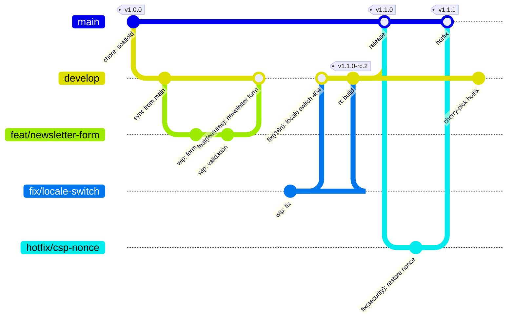

# Branching and releases

Two long-lived branches, short-lived branches off `develop`, squash merges, linear history.

---

## The branches

| Branch          | Role                                      | Protected | Deploys to | Release channel      |
| --------------- | ----------------------------------------- | --------- | ---------- | -------------------- |
| `main`          | Production. Always deployable.            | Yes       | production | stable — `vX.Y.Z`    |
| `develop`       | Integration. Everything lands here first. | Yes       | staging    | `rc` — `vX.Y.Z-rc.N` |
| `<type>/<name>` | One unit of work, hours to a few days     | No        | —          | —                    |

Branch names must match the pattern in `package.json` under `validate-branch-name`:

```text
^(main|develop)$|^(feat|fix|docs|style|refactor|perf|test|build|ci|chore|revert|hotfix|release)/[a-z0-9._-]+$
```

The pre-push hook and `pr-lint.yml` both check it, so a misnamed branch fails before review.



---

## Protection rules

Both branches are protected by a GitHub ruleset. The rulesets are version-controlled as
[`.github/rulesets/main.json`](../.github/rulesets/main.json) and
[`.github/rulesets/develop.json`](../.github/rulesets/develop.json) — import them under
**Settings → Rules → Rulesets** rather than clicking the settings together by hand, so what protects
the branches is reviewable like any other file.

`main` is the stricter of the two.

| Setting                                    | `develop` | `main`                           |
| ------------------------------------------ | --------- | -------------------------------- |
| Pull request required                      | Yes       | Yes                              |
| Approving reviews required                 | 1         | 1                                |
| Code-owner review required                 | No        | Yes                              |
| Stale reviews dismissed on push            | Yes       | Yes                              |
| Approval required after the last push      | No        | Yes                              |
| Conversation resolution required           | Yes       | Yes                              |
| Allowed merge method                       | Squash    | Squash                           |
| Required status check: `ci-ok`             | Yes       | Yes                              |
| Branches must be up to date before merging | Yes       | Yes                              |
| Linear history required                    | Yes       | Yes                              |
| Signed commits required                    | No        | Yes                              |
| Force pushes                               | Blocked   | Blocked                          |
| Deletion                                   | Blocked   | Blocked                          |
| Deployment environment approval            | —         | `production` requires a reviewer |

`ci-ok` is a single aggregating job, so the ruleset never has to be edited when a CI job is added or
renamed. See [ci-cd.md](./ci-cd.md).

The release bot pushes `CHANGELOG.md` and `package.json` back to the protected branch. That push
carries `[skip ci]` in its message so it does not retrigger the pipeline, which is why both rulesets
list bypass actors — the repository admin role and the GitHub Actions integration. Those two entries
are the only exceptions to everything above.

---

## Merge strategy

**Squash and merge, always.** Merge commits and rebase-merges are disabled in the repository
settings.

Why squash specifically:

- A PR becomes exactly one commit, so `git log` on `main` reads as a list of shipped changes rather
  than a transcript of someone's afternoon.
- semantic-release parses that one commit; "wip", "fix typo" and "address review" never reach the
  changelog.
- Reverting a change is `git revert <sha>` on a single commit.

Consequence: **the PR title is the commit message**, and must be a valid Conventional Commit.
`pr-lint.yml` enforces that. Inside your branch, commit however often you like.

---

## The normal path

1. Sync and branch off `develop`:

   ```bash
   git switch develop
   git pull --ff-only
   git switch -c feat/newsletter-form
   ```

2. Work. Commit freely — `pnpm commit` writes conforming messages.
3. `pnpm validate` before pushing (the pre-push hook runs the same checks).
4. Push and open a PR **into `develop`** with a Conventional Commit title.
5. CI runs; `ci-ok` must be green; get the review; squash-merge.
6. `release.yml` publishes an `rc` prerelease, `docker.yml` builds the image, `deploy.yml` ships it
   to **staging**.
7. Verify on staging.

## Promoting to production

1. Open a PR from `develop` into `main`, titled as a release, e.g.
   `feat(release): promote v1.1.0 to production`.
2. The same `ci-ok` gate applies.
3. Squash-merge. `release.yml` cuts a stable release and tags `vX.Y.Z`.
4. `docker.yml` publishes the image for that tag; `deploy.yml` requests approval for the
   `production` environment, then deploys and health-checks.

Promotions are cheap and should be frequent. A `develop` that has drifted many features ahead of
`main` makes a rollback decision much harder.

---

## Release channels

Configured in [`.releaserc.json`](../.releaserc.json):

```json
"branches": ["main", { "name": "develop", "channel": "rc", "prerelease": "rc" }],
"tagFormat": "v${version}"
```

| Branch    | Tag example   | GitHub release | npm dist-tag equivalent |
| --------- | ------------- | -------------- | ----------------------- |
| `main`    | `v1.4.0`      | Latest release | `latest`                |
| `develop` | `v1.5.0-rc.1` | Pre-release    | `rc`                    |

The package is `private: true`, so nothing is published to a registry — the "release" is the git
tag, the GitHub release notes, the generated `CHANGELOG.md` and the container image tagged to match.

---

## Hotfixes

A hotfix is for a production defect that cannot wait for the current `develop` to be ready.

1. Branch **off `main`**, not `develop`:

   ```bash
   git switch main
   git pull --ff-only
   git switch -c hotfix/csp-nonce-missing
   ```

2. Fix it, with a test that fails without the fix.
3. Open a PR into `main`. Full CI still applies — a hotfix that skips the gates is how one incident
   becomes two.
4. Squash-merge. `release.yml` cuts a patch release; the deploy to production runs as usual.
5. **Bring the fix back to `develop`.** Because merges are squashes, `main` and `develop` do not
   share the hotfix commit. Cherry-pick it onto a branch off `develop` and squash-merge that:

   ```bash
   git switch develop
   git pull --ff-only
   git switch -c fix/sync-csp-nonce
   git cherry-pick <hotfix-sha-on-main>
   git push -u origin fix/sync-csp-nonce
   ```

   Skipping this step is the classic way to reintroduce the same bug in the next release.

If the fix is a bad deploy rather than a bad commit, do not write a hotfix — roll back first
(`rollback.yml`, see [deployment.md](./deployment.md)), then fix at leisure.

---

## Housekeeping

- Delete the branch when the PR merges (GitHub does this automatically).
- Rebase a long-running branch onto `develop` rather than merging `develop` into it; linear history
  is required, and a stale branch cannot be merged anyway.
- Never force-push a branch someone else has reviewed mid-review — push a fixup commit instead. The
  squash makes it disappear from history regardless.

---

## Related

- [conventions.md](./conventions.md) — commit and PR title grammar
- [ci-cd.md](./ci-cd.md) — what runs on each branch and each tag
- [deployment.md](./deployment.md) — what happens after the tag exists
- [ADR 0008](./adr/0008-conventional-commits-and-semantic-release.md)
