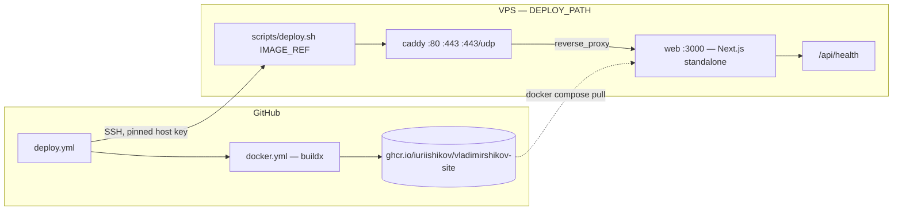

# Deployment

The site runs as a Docker Compose stack on a single VPS: the Next.js standalone server behind Caddy,
which terminates TLS. GitHub Actions builds the image, pushes it to GHCR, and runs
[`scripts/deploy.sh`](../scripts/deploy.sh) on the server over SSH.

The reasoning behind this shape — rather than Vercel or Kubernetes — is in
[ADR 0007](./adr/0007-docker-ghcr-ssh-deployment.md).

---

## Topology



Two services on one private bridge network (`vladimirshikov-edge`):

| Service | Image                                           | Listens                | Role                                                           |
| ------- | ----------------------------------------------- | ---------------------- | -------------------------------------------------------------- |
| `web`   | `ghcr.io/iuriishikov/vladimirshikov-site:<tag>` | `3000`, internal only  | The Next.js standalone server                                  |
| `caddy` | `caddy:2-alpine`                                | `80`, `443`, `443/udp` | TLS termination, automatic certificates, HTTP/3, reverse proxy |

`web` has no `ports:` at all — only `expose`. The only way in is through Caddy, so TLS cannot be
bypassed by accident.

Both containers run read-only with `cap_drop: ALL` and `no-new-privileges`, each with a CPU and
memory limit, and each logging to the `json-file` driver capped at 3 × 10 MB. Nothing about log
rotation or resource ceilings is left to the host's defaults.

---

## The files

The compose stack is version-controlled, so a deploy never depends on a file someone once pasted
onto a server.

| File                          | Where it runs                      | Purpose                                                          |
| ----------------------------- | ---------------------------------- | ---------------------------------------------------------------- |
| `Dockerfile`                  | CI (and `pnpm docker:build`)       | Builds the standalone image                                      |
| `docker-compose.yml`          | The server                         | The production stack: `web` + `caddy`                            |
| `docker-compose.staging.yml`  | The staging server, layered on top | Staging tier, smaller limits, `noindex` robots header            |
| `docker-compose.override.yml` | A developer's machine              | Local stack without TLS — auto-loaded by a bare `docker compose` |
| `Caddyfile`                   | The server, mounted read-only      | TLS, edge headers, proxy rules, access logging                   |
| `scripts/deploy.sh`           | The server, invoked over SSH       | Pull, roll out, health-check, roll back                          |
| `.env`                        | The server only — never committed  | Runtime configuration for both services                          |

Production and staging always name their files explicitly:

```bash
docker compose -f docker-compose.yml up -d --wait                                # production
docker compose -f docker-compose.yml -f docker-compose.staging.yml up -d --wait  # staging
```

The `-f` flags are not decoration. Omitting them lets compose auto-load
`docker-compose.override.yml`, which is the local development file and would quietly reconfigure a
production host.

---

## Prerequisites

On the VPS, once:

- A current Debian or Ubuntu LTS with unattended security upgrades enabled.
- Docker Engine 25 or newer with the Compose v2 plugin (`docker compose version` must work).
- A non-root deploy user in the `docker` group. The deploy key belongs to this user and nothing else.
- SSH hardened: key authentication only, `PasswordAuthentication no`, `PermitRootLogin no`.
- A firewall allowing only SSH, `80` and `443` (TCP and UDP — HTTP/3 needs UDP 443).
- DNS `A` (and `AAAA` if you have IPv6) records pointing at the VPS. Caddy cannot issue a
  certificate before DNS resolves.

In GitHub, once:

- Environments `staging` and `production`, with `production` requiring a reviewer.
- The secrets and variables from [ci-cd.md](./ci-cd.md#secrets-and-variables) set on each
  environment.
- `SSH_KNOWN_HOSTS` filled from `ssh-keyscan -p <port> <host>`. The deploy job pins the host key and
  never disables `StrictHostKeyChecking`.

---

## First-time setup

`DEPLOY_PATH` is a plain directory owned by the deploy user. It is **not** a checkout: the deploy job
ships the four files the server needs — `docker-compose.yml`, `docker-compose.staging.yml`,
`Caddyfile` and `scripts/deploy.sh` — from the runner on every rollout, and everything else the
server runs comes out of the image.

That is deliberate. A checkout would mean bootstrapping a clone by hand before the first deploy, and,
for a private repository, giving the box a second credential purely so it could read its own source.
It would also let the server drift from the commit being deployed.

The directory lives under the deploy user's home rather than in `/opt` for the same reason: `/opt`
needs root to create, and nothing else here needs root at all. Nothing depends on the location — the
only bind mount in the compose file is `./Caddyfile`, which is relative to it.

```bash
# as the deploy user, on the VPS — no sudo, and nothing to clone
mkdir -p ~/vladimirshikov-site
cd ~/vladimirshikov-site
```

That is the whole of it. `.env` is **not** written by hand either: the deploy job renders it from the
environment's own configuration on every rollout, so it looks like this and nobody types it.

```dotenv
# Rendered by the deploy job from vars.SITE_URL and secrets.ACME_EMAIL
SITE_DOMAIN=vladimirshikov.com
ACME_EMAIL=you@example.com

# Read at runtime by the application (src/shared/config/env.ts)
SITE_URL=https://vladimirshikov.com
APP_ENV=production
APP_VERSION=v1.4.0
API_BASE_URL=

# Written by scripts/deploy.sh on every rollout
IMAGE=ghcr.io/iuriishikov/vladimirshikov-site:latest
```

A hand-edit on the server does not survive the next deploy, which is the point: this file used to be
the only piece of the deployment that nobody could see from GitHub, nothing could rebuild and no
review ever covered — and it held a second copy of `SITE_URL`, which the health check already reads
from the environment. Two fields that must agree are a field that will one day disagree.

`SITE_DOMAIN` is derived from `SITE_URL` rather than stored beside it, for the same reason. The file
is written under `umask 077` rather than chmod'ed afterwards, so it is never briefly world-readable.

Three things to understand about this file:

- **`SITE_URL` and `APP_ENV` have no `NEXT_PUBLIC_` prefix on purpose.** They are read on the server
  at request time, so one image is valid for both staging and production — build once, promote the
  artefact. A `NEXT_PUBLIC_*` value is inlined at build time and would force an image per
  environment.
- **`SKIP_ENV_VALIDATION` is deliberately absent.** The image is built with validation skipped, so
  container start is when the real configuration is validated. A typo here fails the health check
  and triggers a rollback rather than serving a broken page.
- **`scripts/deploy.sh` refuses to run** unless `SITE_DOMAIN`, `ACME_EMAIL`, `SITE_URL` and
  `APP_ENV` are all present and non-empty. Without that check an empty `SITE_DOMAIN` makes Caddy
  serve nothing, and a missing `SITE_URL` falls back to a zod default — `http://localhost:3000` in
  every canonical URL, and `Disallow: /` in `robots.txt` on the live site.

Authenticate to GHCR (needed while the package is private) and bring the stack up:

```bash
echo "$GHCR_TOKEN" | docker login ghcr.io -u iuriishikov --password-stdin
./scripts/deploy.sh ghcr.io/iuriishikov/vladimirshikov-site:latest
```

Caddy obtains and renews certificates on its own. They live in the `caddy_data` volume — that volume
is **state, not cache**. Losing it means re-issuing every certificate, which is rate-limited. Back it
up; never `docker volume prune` it away.

---

## How a deploy runs

`deploy.yml` fires on a push to `develop` (staging) or on a `v*` tag / published release (production,
gated on reviewer approval). Its `resolve` job decides the environment and image tag in one place, so
no later job has to branch on the event shape.

Then, in order:

1. **`docker.yml`** builds the multi-arch image, pushes it to GHCR with an SBOM and a provenance
   attestation, and outputs the resolved reference.
2. **Capture the current state.** Over SSH, it reads `$DEPLOY_PATH/.deployed-image` — the reference
   the last successful rollout activated. This is the rollback target, read _before_ anything
   changes.
3. **Roll out.** It runs `./scripts/deploy.sh "$IMAGE_REF"` on the server, forwarding
   `REGISTRY` / `REGISTRY_USERNAME` / `REGISTRY_TOKEN` so the host can pull from GHCR with the
   workflow's own token rather than a stored credential.
4. **Health check from outside.** The workflow curls the public URL
   (`vars.SITE_URL` + `/api/health`) up to 20 times, six seconds apart, and requires
   `.status == "ok"`. Deploying is not the same as working: this check goes through DNS, TLS and
   Caddy, not just the container.
5. **Roll back on failure**, or report loudly if there is nothing to roll back to.

### What `scripts/deploy.sh` does on the server

1. Takes an exclusive lock (`$DEPLOY_PATH/.deploy/lock`, an atomic `mkdir` — no `flock` dependency)
   so two overlapping deploys cannot fight.
2. Asserts the four required `.env` keys are present.
3. Records the image the `web` container is running right now.
4. Writes the new `IMAGE=` into `.env`, so a later bare `docker compose up -d` by a human uses the
   same image the script chose.
5. `docker compose pull` then `docker compose up -d --wait`, layering
   `docker-compose.staging.yml` when `APP_ENV` is `staging`.
6. Polls `/api/health` from inside the container until it answers `{"status":"ok"}` or the timeout
   (`--timeout`, default 120s) expires. With `--health-url` it additionally checks the public URL.
7. On any failure, restores the recorded image, brings it back up and re-verifies.
8. On success, writes the activated reference to `.deployed-image`.

It is safe to re-run. Deploying the image that is already live is a no-op apart from the health
check.

### What makes staging different

`docker-compose.staging.yml` changes three things and nothing else:

- **The tier.** It pins `APP_ENV: staging` in the compose file rather than trusting the host's
  `.env`. A staging box that inherits the production default would serve an indexable `robots.txt`
  and production's canonical URLs.
- **Indexing.** It sets `X_ROBOTS_TAG` to `noindex, nofollow, noarchive`, which the `Caddyfile`
  applies to every response — including ones the app does not annotate itself, such as static assets
  and error pages. Staging serves the same content as production; without that header it competes
  with the real site in search results.
- **Resource limits.** Roughly half the production budget, because a staging box is small and
  usually shared.

It does _not_ need a differently-built image. `SITE_URL` and `APP_ENV` are read at request time, so
one artefact serves both tiers. The default tag in the staging file simply points at the build CI
publishes from `develop`.

---

## Health checks

`GET /api/health` returns:

```json
{
  "status": "ok",
  "version": "1.4.0",
  "uptime": 12.37,
  "timestamp": "2026-08-24T09:12:44.108Z"
}
```

It is consumed in five places, which is why it is worth keeping fast and dependency-free:

| Consumer                      | Purpose                                                        |
| ----------------------------- | -------------------------------------------------------------- |
| The image's own `HEALTHCHECK` | What Docker reports as container health                        |
| Compose `healthcheck`         | Gates `caddy` on `web` being healthy; drives `up -d --wait`    |
| `scripts/deploy.sh`           | Decides whether the rollout succeeded or must be reverted      |
| `deploy.yml`                  | Verifies the public URL end to end, through DNS, TLS and Caddy |
| `playwright.config.ts`        | The `webServer.url` the test runner waits on                   |

`version` comes from `APP_VERSION`, which the pipeline sets to the released version — so comparing it
against the expected tag is the quickest way to confirm what is actually running:

```bash
curl -fsS https://vladimirshikov.com/api/health | jq
```

The `Caddyfile` skips access-logging this path (`log_skip @health`). Polled every few seconds by
deploy scripts and uptime monitors, it would otherwise bury everything that matters. It is also
reachable over plain HTTP, so an internal monitor can check it without a certificate; every other
path redirects to HTTPS.

---

## Rollback

### Automatic

If the workflow's health check fails and a previous reference was captured, `deploy.yml` re-runs
`./scripts/deploy.sh` with that reference. `scripts/deploy.sh` has its own inner rollback as well,
covering the case where the stack never becomes healthy at all.

If **no** previous image was recorded, the workflow says so explicitly and fails: the server is
running the new image, and a human has to decide. That is the one case where the automation stops
rather than guessing.

This only covers a deploy that is _detectably_ broken. A deploy that starts cleanly and behaves
wrongly needs the manual path.

### Manual

Use `rollback.yml` (**Actions → Rollback → Run workflow**) with:

- `environment`: `staging` or `production`
- `image_tag`: a tag or digest GHCR already holds — `v1.3.2`, `sha-a1b2c3`, or `sha256:…`
- `reason`: optional, recorded in the run summary. Write it; the next person reading the history
  will not have your context.

It never rebuilds, so what goes back out is byte-identical to what was known to work.

To see what is available:

```bash
gh api "/users/iuriishikov/packages/container/vladimirshikov-site/versions" \
  --jq '.[].metadata.container.tags | select(length > 0) | .[]'
```

### Last resort, on the box

```bash
cd ~/vladimirshikov-site
make deploy-prod DEPLOY_IMAGE=ghcr.io/iuriishikov/vladimirshikov-site:v1.3.2
# staging: make deploy-staging DEPLOY_IMAGE=…:develop
```

`make deploy-prod` and `make deploy-staging` are thin wrappers over `scripts/deploy.sh` — the same
code path CI invokes over SSH, so a manual recovery is not a separate, untested procedure.

Use the script rather than editing `.env` and running compose by hand: it takes the lock, records
the previous image and verifies health, none of which a bare `up -d` does. If a dead deploy left
the lock behind, `scripts/deploy.sh` will say so; remove `.deploy/lock` only after confirming no
deploy is running.

Then still trigger `rollback.yml` afterwards, so the workflow history reflects reality. A server
whose state was last changed by hand is a server nobody trusts.

---

## Zero-downtime notes

`docker compose up -d` replaces the `web` container, so there is a gap of a few seconds. That gap is
not zero, and this stack does not pretend otherwise:

- `caddy` stays up throughout and keeps its TLS state, so visitors see a brief `502` at worst, not a
  connection failure.
- `depends_on: condition: service_healthy` means Caddy is never started against a `web` that has not
  passed its health check.
- `stop_grace_period: 20s` gives in-flight requests time to finish rather than cutting them off.
- The proxy's `dial_timeout 5s` and `response_header_timeout 30s` give a cold start a moment instead
  of turning a slow first render into a `502`.
- `restart: unless-stopped` covers crashes and host reboots.

If the gap ever matters, the smallest honest upgrade is two `web` replicas with Caddy load balancing
across them, rolled one at a time — a change to `docker-compose.yml` and the `Caddyfile` only; the
deploy workflow does not need to know. For a personal site, a few seconds during a deliberate deploy
is not worth the extra moving parts.

---

## Logs and observability

```bash
cd ~/vladimirshikov-site

docker compose -f docker-compose.yml ps                       # what runs, and whether it is healthy
docker compose -f docker-compose.yml logs -f --tail=200 web   # application logs
docker compose -f docker-compose.yml logs -f --tail=200 caddy # TLS issuance, upstream errors, access log
docker stats --no-stream                                      # memory and CPU against the limits
```

Caddy writes JSON access logs to stdout rather than to a file, so `docker compose logs` is the single
place log volume is controlled — and the `json-file` driver's `max-size: 10m` / `max-file: 3` caps it
in `docker-compose.yml`. There is no unrotated log file waiting to fill the disk.

Where to look first, by symptom:

| Symptom                          | Look at                                                                         |
| -------------------------------- | ------------------------------------------------------------------------------- |
| Deploy failed at the health step | `docker compose logs web` — usually env validation rejecting `.env`             |
| `deploy.sh` refused to start     | A missing key in `.env`, or a stale `.deploy/lock` from a killed deploy         |
| Certificate errors               | `docker compose logs caddy` — DNS not resolving yet, or ACME rate limits        |
| `502` from Caddy                 | `web` is unhealthy or restarting; check `docker compose ps`                     |
| Site is slow                     | `docker stats` against the CPU/memory limits, then the last PR's Lighthouse run |
| Staging appearing in search      | `curl -I` and check `X-Robots-Tag` — the staging override should set `noindex`  |

After editing the `Caddyfile`, reload without dropping connections:

```bash
docker compose -f docker-compose.yml exec caddy caddy reload --config /etc/caddy/Caddyfile
```

There is no metrics stack here on purpose: `/api/health` plus an external uptime check pointed at it
covers what a personal site needs. Add more when there is a question you cannot answer, not before.

---

## Related

- [ci-cd.md](./ci-cd.md) — the workflows, secrets and variables that drive this
- [security.md](./security.md) — the non-root read-only container and the header policy
- [ADR 0007](./adr/0007-docker-ghcr-ssh-deployment.md) — why a single VPS
